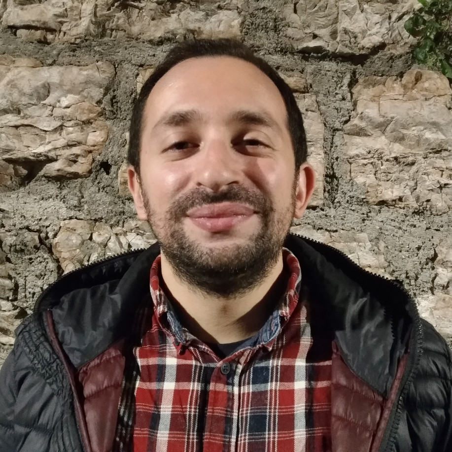

## Welcome

This website provides an overview of our research on visually-grounded language in a continual learning setting. The work is jointly led by [Raffaella Bernardi](http://disi.unitn.it/~bernardi/) of the Language and Vision group led by at the University of Trento, [Barbara Plank](https://bplank.github.io/) of the Natural Language Processing group at the University of Copenhagen and [Raquel Fernández](https://staff.fnwi.uva.nl/r.fernandezrovira/) of the Dialogue Modelling group at the University of Amsterdam. The three group leaders have equally contributed to all papers included here.

## Contributors

<table id='contributor-table'>
  <tr>
    <td>
      
    </td>
    <td>
      
    </td>
    <td>
      
    </td>
    <td>
      
    </td>
  </tr>
  <tr>
    <td>
      
Claudio Greco

    </td>
    <td>
      
Barbara Plank

    </td>
    <td>
      
Raquel Fern&aacute;ndez

    </td>
    <td>
      
Raffaella Bernardi

    </td>
  </tr>
</table>

## Papers

### Psycholinguistics meets Continual Learning: Measuring Catastrophic Forgetting in Visual Question Answering
Claudio Greco, Barbara Plank, Raquel Fern&aacute;ndez, and Raffaella Bernardi
#### ACL 2019
> We study the issue of catastrophic forgetting in the context of neural multimodal approaches to Visual Question Answering (VQA). Motivated by evidence from psycholinguistics, we devise a set of linguistically-informed VQA tasks, which differ by the types of questions involved (Wh-questions and polar questions). We test what impact task difficulty has on continual learning, and whether the order in which a child acquires question types facilitates computational models. Our results show that dramatic forgetting is at play and that task difficulty and order matter. Two well-known current continual learning methods mitigate the problem only to a limiting degree.

PDF coming soon | Supplementary material | Code coming soon | Dataset coming soon
